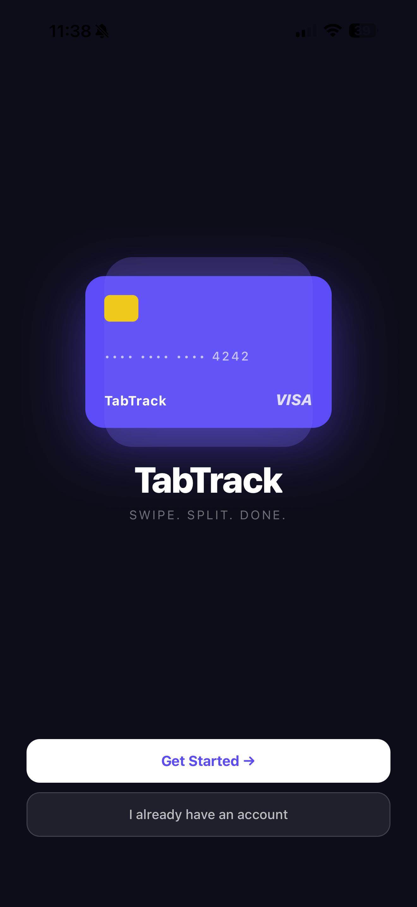
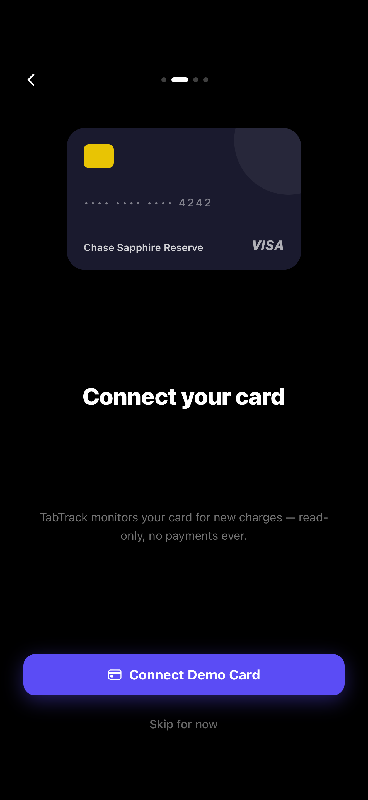
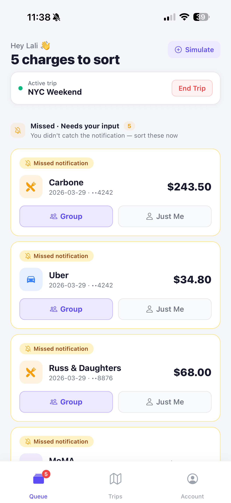
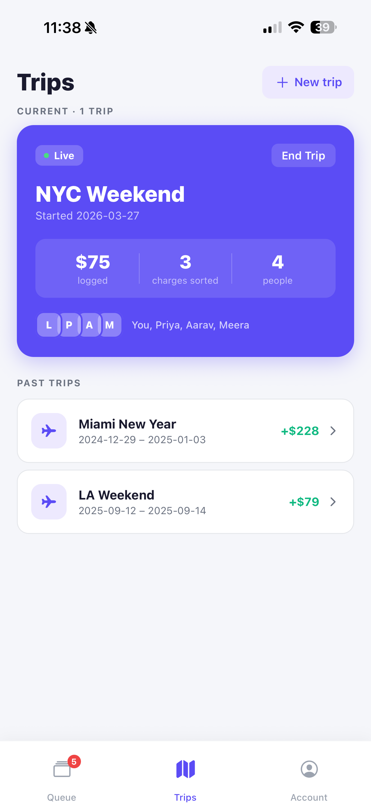
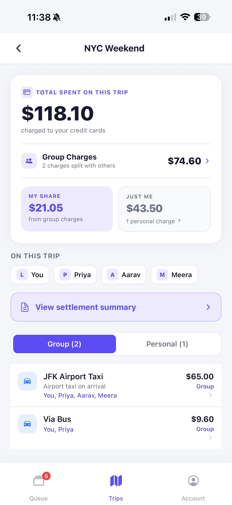
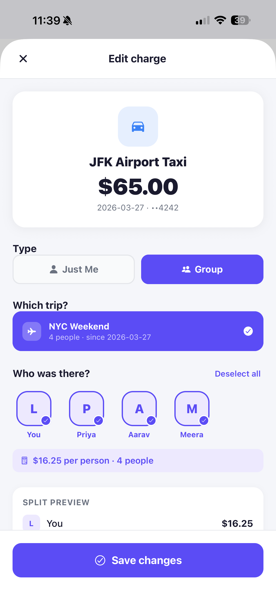

# TabTrack

> **Swipe. Split. Done.**
> The moment your card is charged, TabTrack asks one question: group expense or just you? Everything else — who was there, what they owe, the settlement — happens later.

---

## The Problem

You're on a trip with friends. Someone puts their card down for dinner, the Uber, the museum tickets. A few days later a $140 charge shows up and you genuinely can't remember what it was for. Splitwise requires you to manually log every expense — meaning you forget half of them. A Notes list is chaos.

**TabTrack closes that gap.** The moment a charge posts, you get a push notification with two lock-screen buttons: **Group** or **Just Me**. Five seconds. That's it.

---

## Screenshots

> _Add screenshots here after recording — replace the placeholders below_

| Splash | Onboarding | Connect Card |
|--------|------------|--------------|
|  |  |  |

| Home — Queue | Charge Assign | Trip Detail |
|--------------|--------------|-------------|
|  |  |  |

---

## Features

- **Animated splash screen** — Card-swipe animation with "Swipe. Split. Done." on first launch
- **5-slide onboarding carousel** — Animated feature walkthrough with unique per-slide animations
- **Mock card connection** — Live progress bar + checklist animation simulating a Plaid connection
- **Lock-screen action buttons** — Respond to charges with **Group** or **Just Me** without opening the app
- **Multiple simultaneous active trips** — Run as many trips at once as you need; no trip blocks another
- **Calendar date picker** — Custom built-in date range picker (no extra packages)
- **Contacts-based invite** — Import trip members from your contacts or share an invite link
- **Trip picker on charge assignment** — When multiple trips are active, choose which one a charge belongs to
- **Quick Sort Banner** — One-tap triage when opening a charge from a notification
- **Auto-classification** — Remove all members from a group charge and it automatically flips to Personal
- **Charge reassignment** — Tap any resolved charge in Trip Detail to edit or move it
- **Live stats card** — Total spent, group charges, and your personal share — updates as you reassign

---

## Tech Stack

| Layer | Technology |
|-------|-----------|
| Framework | React Native (Expo SDK 54) |
| Language | JavaScript (JSX) |
| Platform | iOS — built and run via Xcode |
| Navigation | React Navigation v6 (Native Stack + Bottom Tabs) |
| State | Context API + useReducer |
| Animations | React Native Animated API (`spring`, `timing`, `sequence`, `Easing`) |
| Notifications | expo-notifications with iOS action categories |
| Contacts | expo-contacts |
| Calendar | Custom-built component (no new native packages) |
| Sharing | React Native Share API |

---

## Project Structure

```
src/
├── context/
│   └── AppContext.js          # Global state + all actions (useReducer)
├── data/
│   └── mockData.js            # Mock charges, trips, users
├── navigation/
│   └── AppNavigator.js        # Tab + stack navigator, splash gate
└── screens/
    ├── SplashScreen.js         # Animated entry screen
    ├── OnboardingScreen.js     # 5-step first-run flow + feature carousel
    ├── HomeScreen.js           # Triage queue + active trip banner
    ├── ChargeAssignScreen.js   # Member picker, trip picker, quick sort
    ├── CreateTripScreen.js     # Trip creation, calendar picker, invite
    ├── TripsScreen.js          # Active + past trips list
    ├── TripDetailScreen.js     # Charges grouped by type, stats card
    ├── SettlementScreen.js     # Who owes what, itemized breakdown
    └── SettingsScreen.js       # Cards, notifications, account
```

---

## What's Mocked vs. Real

| Feature | Status |
|---------|--------|
| Card connection (Plaid) | Simulated — animated mock flow; real Plaid requires a backend |
| Real-time charge notifications | Functional via expo-notifications + simulated charges |
| Lock-screen Group / Just Me buttons | Real — iOS notification action categories |
| Contacts picker | Real — uses expo-contacts (device permission required) |
| Share invite link | Real — uses native iOS Share Sheet |
| Share settlement summary | Real — uses native iOS Share Sheet |
| Venmo deep-link | Real — opens Venmo app |
| All navigation & state | Fully functional |
| Location-based trip detection | Configured; requires physical device |

---

## Running Locally

### Prerequisites

- **macOS** with Xcode 15+ installed
- **Node.js 18+** — [nodejs.org](https://nodejs.org)
- **CocoaPods** — `sudo gem install cocoapods`
- An **iPhone** or the iOS Simulator (comes with Xcode)

### Setup

```bash
# 1. Clone the repo
git clone https://github.com/your-username/tabtrack.git
cd tabtrack

# 2. Install JavaScript dependencies
npm install

# 3. Install iOS native dependencies
cd ios && pod install && cd ..
```

### Run on Simulator

```bash
# Terminal 1 — start the Metro bundler
npm start

# Terminal 2 — open Xcode and run
open ios/TabTrack.xcworkspace
# Press the ▶ Run button in Xcode (or ⌘R)
```

### Run on a Physical iPhone

1. Connect your iPhone via USB and trust the Mac
2. In Xcode → Signing & Capabilities → set your Apple ID as the team
3. Find your Mac's IP address:
   ```bash
   ipconfig getifaddr en0
   ```
4. Update `ios/TabTrack/AppDelegate.swift` — replace the IP in `bundleURL()`:
   ```swift
   return URL(string: "http://YOUR_MAC_IP:8081/.expo/.virtual-metro-entry.bundle?platform=ios&dev=true&minify=false")
   ```
5. Make sure your iPhone and Mac are on the **same Wi-Fi network** (no VPN)
6. Select your iPhone in Xcode's device picker and press ▶ Run

> **Metro hanging?** Run `watchman watch-del-all && npm start -- --reset-cache`
> **Port in use?** Run `kill -9 $(lsof -t -i:8081)`

---

## Mock Data Pre-loaded

The app opens with:
- An active **NYC Weekend** trip with Priya, Aarav, and Meera
- **5 pending charges** in the triage queue (Carbone, Uber, Russ & Daughters, MoMA, The Spotted Pig)
- **3 resolved charges** (JFK taxi, Whole Foods personal, Via bus)
- **2 past trips** (Miami New Year, LA Weekend)

Use the **Simulate** button (top-right of Home screen) to add new fake charges and experience the full notification flow.

---

## Roadmap

- [ ] Real Plaid card connection (requires Node backend + webhooks)
- [ ] Multi-device sync via backend API
- [ ] Venmo / PayPal OAuth for one-tap settlement requests
- [ ] Automatic charge categories (Food, Transport, Accommodation)
- [ ] Multi-currency support for international trips

---

## Author

Built by **Lali** — [your-portfolio-link.com](https://your-portfolio-link.com)
